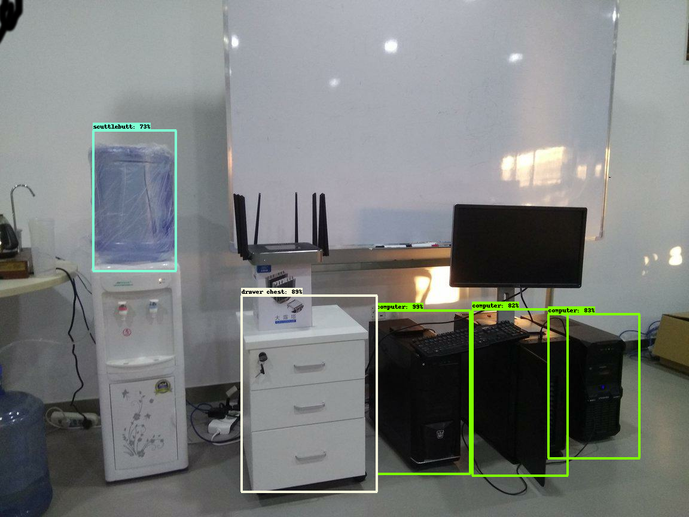

# 简介
本文为系列课程, 第八周部分的课后作业内容。
http://edu.csdn.net/lecturer/1427

## 作业
利用slim框架和object_detection框架，做一个物体检测的模型。通过这个作业，学员可以了解到物体检测模型的数据准备，训练和验证的过程。

### 数据集
本数据集拥有5个分类，共150张图片，每张图片都做了标注，标注数据格式与voc数据集相同。数据地址如下：
https://gitee.com/ai100/quiz-w8-data.git

数据集中各目录如下
- images， 图片目录，数据集中所有图片都在这个目录下面。
- annotations/xmls, 针对图片中的物体，使用LabelImg工具标注产生的xml文件都在这里，每个xml文件对应一个图片文件，每个xml文件里面包含图片中多个物体的位置和种类信息。

>LabelImg工具地址：https://github.com/tzutalin/labelImg.git

### 代码
本次代码使用tensorflow官方代码，代码地址如下：
https://github.com/tensorflow/models.git
主要使用的是research/object_detection目录下的物体检测框架的代码。这个框架同时引用slim框架的部分内容，需要对运行路径做一下设置，不然会出现找不到module的错误。
设置运行路径的方式有两种：
- 直接在代码中插入路径，使用**sys.path.insert**，具体内容留作学员作业，请自行查找相关资料
- 使用环境变量PYTHONPATH，参考https://github.com/tensorflow/models/blob/master/research/object_detection/g3doc/installation.md，具体内容留作学员作业，请自行查找相关资料

### 预训练模型
object_detection框架提供了一些预训练的模型以加快模型训练的速度，不同的模型及检测框架的预训练模型不同，常用的模型有resnet，mobilenet以及最近google发布的nasnet，检测框架有faster_rcnn，ssd等，本次作业使用mobilenet模型ssd检测框架，其预训练模型请自行在model_zoo中查找:
https://github.com/tensorflow/models/blob/master/research/object_detection/g3doc/detection_model_zoo.md

### 结果评估

学员在tinymind上的模型应满足以下条件可认为及格：

#### 数据准备完成
学员的模型引用的数据集中，应包含以下文件，文件名可能会有所区别，但是至少会有这些文件
- checkpoint  预训练模型相关文件
- model.ckpt.data-00000-of-00001  预训练模型相关文件
- model.ckpt.index  预训练模型相关文件
- model.ckpt.meta  预训练模型相关文件
- labels_items.txt  数据集中的label_map文件
- pet_train.record  数据准备过程中，从原始数据生成的tfrecord格式的数据
- pet_val.record  数据准备过程中，从原始数据生成的tfrecord格式的数据
- ssd_mobilenet_v1_pets.config  piplineconfig文件
#### 训练过程正常运行并结束
出现以下log，没有明显异常退出的提示，没有明显错误：
```
INFO:tensorflow:depth of additional conv before box predictor: 0
INFO:tensorflow:depth of additional conv before box predictor: 0
INFO:tensorflow:Summary name /clone_loss is illegal; using clone_loss instead.
...............
INFO:tensorflow:Restoring parameters from /path/to/model.ckpt
INFO:tensorflow:Starting Session.
INFO:tensorflow:Saving checkpoint to path /path/to/train/model.ckpt
INFO:tensorflow:Starting Queues.
INFO:tensorflow:global_step/sec: 0
INFO:tensorflow:global step 15: loss = 10.6184 (0.212 sec/step)
INFO:tensorflow:global step 16: loss = 10.7582 (0.221 sec/step)
INFO:tensorflow:global step 17: loss = 9.4801 (0.209 sec/step)
INFO:tensorflow:global step 18: loss = 9.4556 (0.219 sec/step)
```
> log中出现的 deprecated WARNING，  tried to allocate 0 bytes， Request to allocate 0 bytes等内容属于框架本身的msg，不影响训练过程。
#### 验证有结果输出
scalars有各个分类和平均AP输出。
图表界面中，有输出结果，images能输出有如下标定框的图片：

> 本作业只要框架能正确运行并输出就可以认为及格，对输出准确率不做要求。


## 要点提示
本作业为开放性作业，不提供写好的代码，所有内容均由学员自己查资料完成。为避免学员因对流程的不熟悉浪费太多的时间，这里提供一些关键流程的要点提示。本作业主要参考：
https://github.com/tensorflow/models/blob/master/research/object_detection/g3doc/running_pets.md

这个官方的的参考文档里面，提供的是在cloud上运行一个针对宠物图片的识别框架的训练流程，本作业主要是本地和tinymind上的操作，所以运行的命令和操作方式略有不同，请学员注意区别。

### 下载代码：
直接git clone或者下载压缩包即可

### 下载数据
直接git clone或者下载压缩包即可

### 数据准备
数据准备过程推荐在本地完成，需要一个安装了tensorflow的shell环境，推荐使用ubuntu环境，使用windows的学员推荐在虚拟机中完成，使用mac的学员可直接在**终端**中完成所有数据准备过程。环境配置过程不再详述，请自行查找相关资料。需要注意本文曾提到过的因路径设置导致找不到module的问题。

#### 代码修改
以models官方代码models/research/object_detection/dataset_tools/create_pet_tf_record.py为基础进行修改，该代码将xml文件中的图片尺寸信息和物体位置信息统一进行处理，物体位置会转换成0～1之间的比例，物体名字会根据label_map转换成一个数字列表，结果会存入tfrecord中。请仔细阅读代码，确保理解代码中执行的操作。

代码修改注意要点：
- 本作业的数据集没有mask，所以代码中所有关于faces_only和mask的代码都要删除。
- 图片的class需要直接从xml文件的**name**字段中获取，所以get_class_name_from_filename函数相关的内容都要删除。
- 官方教程中提到的label_map_path文件，请直接使用数据集中的labels_items.txt文件，其内容的格式与pet_label_map.pbtxt文件相同，但是只有5项。
- 本数据集xml文件中，filename项有扩展名，这里需要注意

#### 生成数据
执行数据生成脚本
```
python object_detection/dataset_tools/create_data.py --lbel_map_path=/path/to/labels_items.txt --data_dir=/path/to/data --output_dir=/path/to/out
```

执行完后，会在/path/to/out下面生成两个.record文件。
- name_train.record
- name_val.record
> **name**为指定的输出文件前缀，如果没改的话，应该是**pet**，作业中不建议学员修改输出文件名，直接使用原始文件名即可。

#### 编辑pipline.config文件
以models/research/object_detection/samples/configs/ssd_mobilenet_v1_pets.config为基础进行修改。
这个文件里面放了训练和验证过程的所有参数的配置，包括各种路径，各种训练参数（学习率，decay，batch_size等）。有这个文件，命令行上面可以少写很多参数，避免命令行内容太多。

注意要点：
- num_classes， 原文件里面为37,这里的数据集为5
- num_examples， 这个是验证集中有多少数量的图片，请根据图片数量和数据准备脚本中的生成规则自行计算。
- PATH_TO_BE_CONFIGURED，这个是原文件中预留的字段，一共5个，分别包含预训练模型的位置，训练集数据和label_map文件位置，验证集数据和label_map文件位置。这个字段需要将数据以及配置文件等上传到tinymind之后才能确定路径的具体位置，不过tinymind支持覆盖上传，所以可以先将数据上传，再根据数据在tinymind上的路径修改配置文件，路径可以在创建模型的时候，在添加数据集的地方找到。
- num_steps，这个是训练多少step，后面的训练启动脚本会用到这个字段，直接将原始的200000改成0.注意不要添加或者删除空格等，后面的训练启动脚本使用sed对这个字段进行检测替换，如果改的有问题会影像训练启动脚本的执行。
- max_evals，这个是验证每次跑几轮，这里直接改成1即可，即每个训练验证循环只跑一次验证。

>训练和验证过程次数相关的参数，后面在训练启动脚本中会自动进行处理，这里不需要过多关注，但是实际使用的时候，需要对这些参数进行合适的设置，比如**num_steps**参数，后面的训练启动脚本中，每轮运行100个step，同时根据数据集图片总数all_images_count和batch_size的大小，可以计算出epoch的数量，最后输出模型的质量与epoch的数量密切相关。epoch=num_step*batch_size/all_images_count。具体的计算留给学员自己进行。

#### 数据上传
请学员自行在自己的tinymind账户中建立数据集。tinymind一个数据集中可以有多个不同用途的文件，这里要求学员将模型用到的所有文件，训练数据，配置，label_map等都放到一个数据集中，便于模型的使用以及助教对作业结果的判断。

### 训练系统脚本 run.sh
由于本作业中使用的框架，训练和验证分别在两个进程中执行，而tinymind目前不支持这种方式运作，所以这里提供一个训练启动脚本，来顺序执行训练和验证过程。训练启动脚本内容参考本仓库中的附件**run.sh**，以及其中的注释。脚本的内容涉及linuxshell编程，超出本课程教授范围，不做详细解释，感兴趣的学员请自行分析脚本内容。

这个脚本需要放到models/research目录，与object_detection和slim平行。

### 训练代码
训练代码不需要做任何修改，只把本作业提供的训练启动脚本加入训练代码响应目录就可以。因为models目录包含了大量与本次作业无关的代码，可以适当的删除一些东西，仅保留models/research下面的object_detection和slim目录就可以。

### 模型建立
上一步将训练启动脚本加入代码之后，将训练的所有代码压缩城zip包，在建立模型的时候，使用压缩包方式上传代码。模型运行环境为python3.6/Tensorflow1.3，模型代码载入点为models/research/run.sh。

tinymind运行模型的时候，会自动将上传的压缩包解压到/tinysrc/目录，所以压缩包的路径也会影像代码的载入点路径。路径问题训练启动脚本已经做过相关处理，如果仍然出现找不到module或者文件问题，请自行尝试修改训练启动脚本，或者直接修改训练代码。

### 模型运行
代码建立之后，模型可以开始运行，运行结果会在log中显示，如果没有出现明显的错误，那么运行应该很快会结束（1小时以内）。运行结束之后可以查看图表Tab和输出Tab，对运行的结果进行判断。

本次作业中，模型的各个参数都使用默认的，所以训练的结果应该会比较好，各个分类的AP（Average Precision）应该都在80%以上，标定的结果也会比较准确。不过本次作业对AP等指标不做任何要求，只要训练正常完成即可认为作业成功完成。
